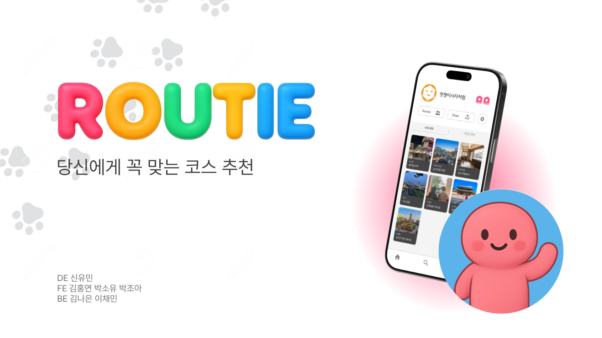

# 🤍 ROUTIE – 당신에게 꼭 맞는 코스 추천

> ROUTIE는 사용자의 취향과 상황을 기반으로  
> **AI가 하루의 흐름을 ‘루트’로 설계해주는 지도 기반 추천 서비스입니다.**

## 📌 프로젝트 개요

| 항목 | 내용 |
|------|------|
| 프로젝트명 | ROUTIE |
| 프로젝트 성격 | 해커톤 / 팀 프로젝트 |
| 핵심 기능 | AI 기반 하루 루트 추천 |
| 기획 의도 | 사용자의 감정 + 상황 기반 일정 추천 |
| 개발 환경 | React + Express + Serverless |
| 배포 환경 | Vercel |

### 👩🏻‍💻 담당 역할 

| **Frontend** | **AI Agent** |
|------|------|

---

## ✨ 핵심 기능

- **지도 기반 장소 탐색**
- **코스 생성/저장 및 공유**
- **대화형 AI 추천 하루 루트 생성 (Routie Agent)💬**

---

## 🧑‍💻 Tech Stack

### Frontend
- React + Vite
- JavaScript
- Tailwind CSS
- Kakao Map API

### AI / Serverless
- Gemini API
- Express (로컬 개발용 프록시 서버)
- Vercel Serverless Function (배포용)

---
# 🤖 Routie – AI Route Agent

Related Issue: 

[#35 [Feat] 프론트에서 루티(Routie) AI 하루 루트 생성 기능 직접 설계 & 구축 (Gemini 연동 + 프록시 서버 + 서버리스 + UI)](https://github.com/LINE4THON-team17/Routie-Client/issues/35)

Related PR: 

[#38 [FEAT] ROUTIE AI 챗봇 연동 및 홈/코스 상세 기능 연결 (#30 #33 #35)](https://github.com/LINE4THON-team17/Routie-Client/pull/38)

`Routie(루티)`는 ROUTIE의 AI 추천 엔진으로,  
**사용자의 취향을 단계별 질문으로 수집한 뒤  
Gemini API를 이용해 하루 루트를 JSON 형태로 생성하는 에이전트**입니다.


https://github.com/user-attachments/assets/96c7391a-1599-4489-90e1-7b97f517b9c6


### 기획 포인트
- 단순한 “장소 추천”이 아닌  
  → **아침부터 저녁까지 이어지는 ‘하루의 흐름’ 설계**
- 감성적인 말투 + 실제 존재하는 장소 기반
- 응답은 **프론트 UI와 바로 연동 가능한 JSON 포맷**

---
## 🔄 AI 루트 생성 처리 흐름

1. 사용자가 질문 단계에서 옵션 선택 또는 채팅 작성
2. 선택한 모든 값 → 하나의 `userPrompt`로 조합
3. `callRoutieAgent`를 통해 API 요청
4. 로컬 개발:
   - React → Express → Gemini
5. 배포 환경:
   - React → Vercel Serverless → Gemini
6. Gemini 응답 수신
7. ```json``` 블럭만 파싱하여 루트 데이터 추출
8. 루트 카드 UI에 실시간 반영

---

## 🏗 AI Agent 개발환경 (로컬 + 배포 이중 구조)
### 로컬


### 배포


- 개발 환경에서는 **Express 프록시 서버 사용**  
- 배포 환경에서는 **Serverless Function으로 동일한 역할 수행**  
---



